# 🎓 Student Management System

A console-based **Student Management System** developed in **C++** using **Object-Oriented Programming (OOP)** concepts. The application allows users to efficiently manage student records with complete **CRUD (Create, Read, Update, Delete)** functionality, persistent file storage, sorting, and input validation.

---

## ✨ Features

- ➕ Add Student Record
- 📋 Display All Students
- 🔍 Search Student by Roll Number
- ✏️ Update Student Details
- 🗑️ Delete Student Record
- 📊 Display Total Number of Students
- 🔃 Sort Students by:
  - Roll Number
  - Name
  - CGPA
- 💾 Automatic Data Saving using File Handling
- 📂 Automatic Data Loading on Program Startup
- ✅ Duplicate Roll Number Validation
- ✅ Age Validation
- ✅ CGPA Validation
- 🖥️ Menu-Driven Console Interface

---

## 🛠️ Technologies Used

- **Language:** C++
- **Concepts:** Object-Oriented Programming (OOP)
- **Data Structure:** STL Vector
- **File Handling:** fstream
- **IDE:** Visual Studio Code
- **Compiler:** MinGW (GCC)
- **Version Control:** Git & GitHub

---

## 📂 Project Structure

```text
Student_Management_System/
│
├── .gitignore
├── README.md
├── main.cpp
├── Student.h
├── Student.cpp
├── StudentManager.h
├── StudentManager.cpp
└── students.txt
```

---

## 🚀 How to Run

### Clone the repository

```bash
git clone https://github.com/madhurkamble/Student-Management-System.git
```

### Navigate to the project

```bash
cd Student-Management-System
```

### Compile

```bash
g++ main.cpp Student.cpp StudentManager.cpp -o StudentManagementSystem
```

### Run

```bash
./StudentManagementSystem
```

> **Windows**

```bash
StudentManagementSystem.exe
```

---

## 📸 Application Features

- Add Student
- Display Student Records
- Search Student
- Update Student Information
- Delete Student
- Sort Student Records
- Display Total Students
- Automatic Save & Load using File Handling

### Screenshot 1
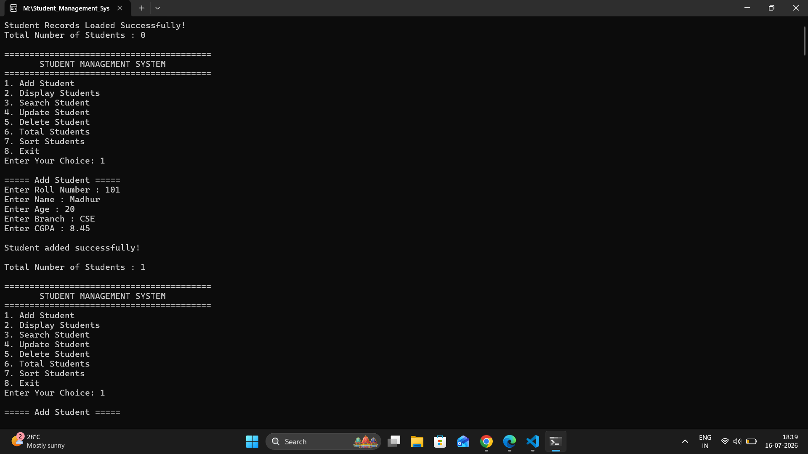

### Screenshot 2
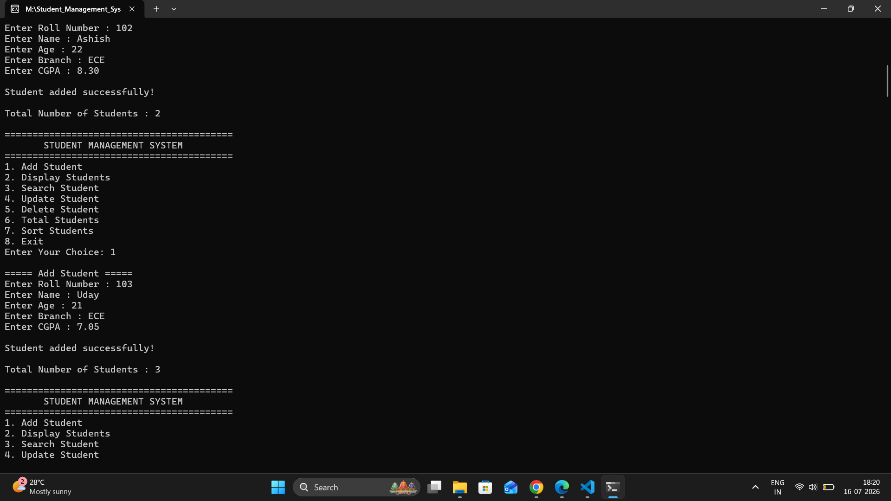

### Screenshot 3
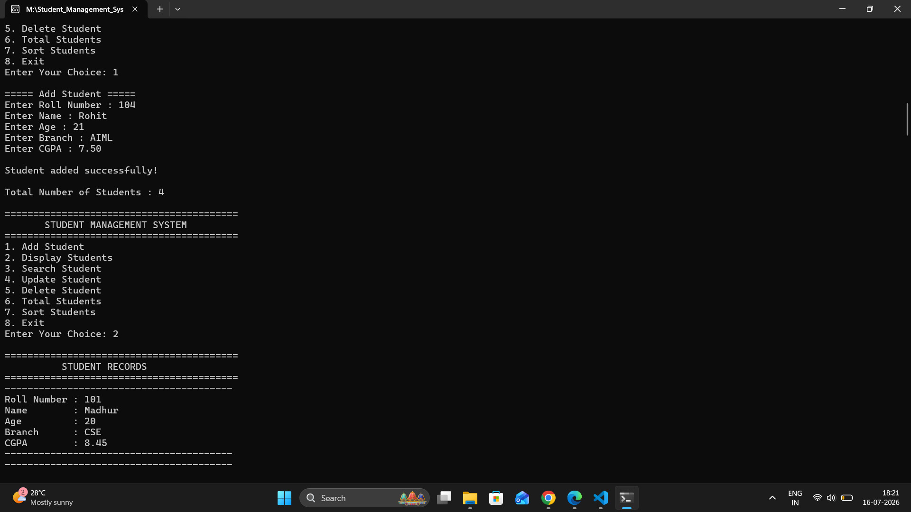

### Screenshot 4
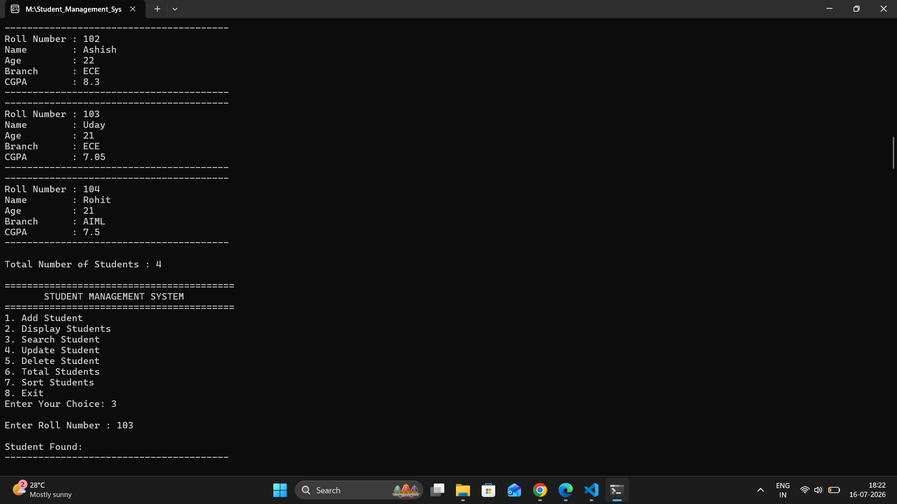

### Screenshot 5
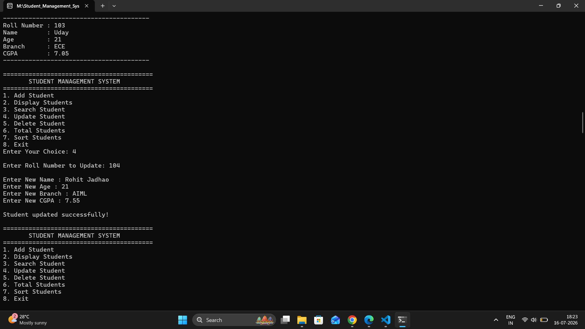

### Screenshot 6
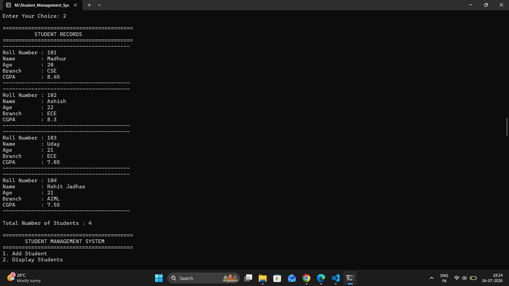

### Screenshot 7
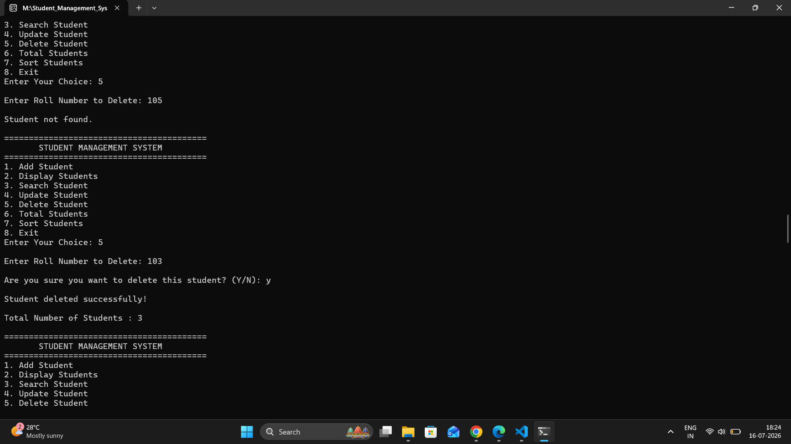

### Screenshot 8
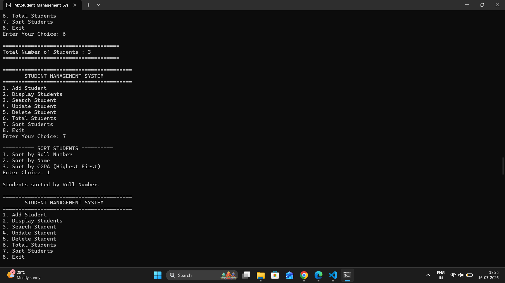

### Screenshot 9
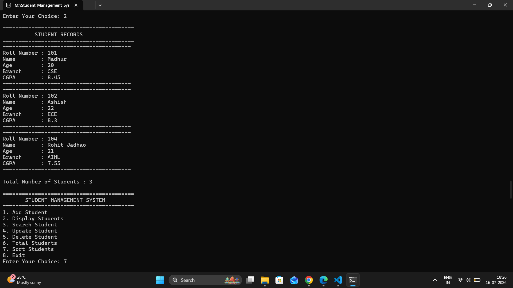

### Screenshot 10
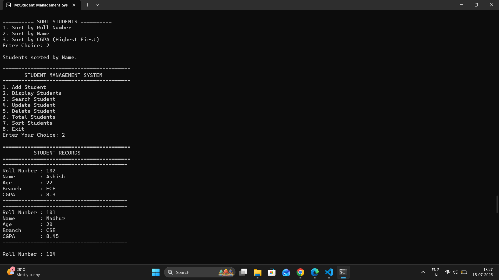

### Screenshot 11
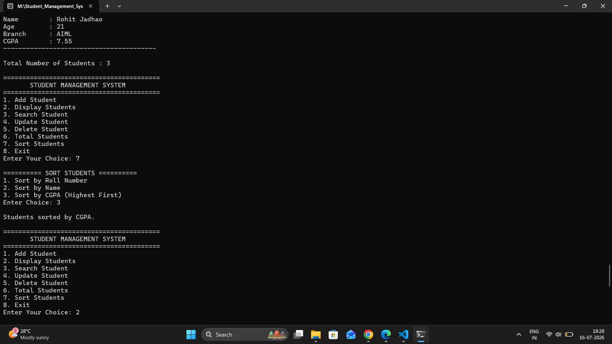

### Screenshot 12
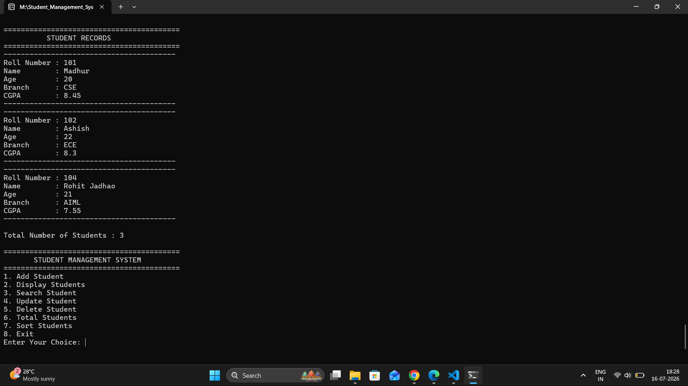

---

## 💡 Concepts Demonstrated

- Object-Oriented Programming
- Classes & Objects
- Encapsulation
- Constructors
- Member Functions
- File Handling
- STL Vector
- Bubble Sort
- Input Validation
- Modular Programming
- CRUD Operations

---

## 🔮 Future Enhancements

- Graphical User Interface (GUI)
- Database Integration (MySQL/SQLite)
- Student Attendance Management
- Export Records to CSV
- Advanced Search & Filtering
- Authentication System

---

## 👨‍💻 Author

**Madhur Kamble**

- GitHub: https://github.com/madhurkamble
- LinkedIn: https://www.linkedin.com/in/madhur-kamble-55911b290

---

## ⭐ Support

If you found this project helpful, consider giving it a **⭐ Star** on GitHub.
